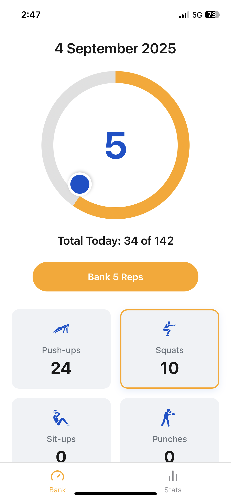

# Crunch Challenge 🏋️‍♂️

**Crunch Challenge** is a simple Progressive Web App (PWA) fitness tracker built with vanilla HTML, CSS, and JavaScript. It helps users complete and bank daily exercise reps, track progress, and view stats — all installable as a standalone app on mobile and desktop.



---

## 🚀 Features
- Add exercises (push-ups, sit-ups, squats, etc.) and bank reps daily.  
- Progress wheel to visualize input.  
- Daily summary of total reps.  
- Stats view with historical breakdowns.  
- Works offline (via service worker caching).  
- Installable as a PWA (Add to Home Screen).  

---

## 🛠️ Tech Stack
- **Frontend:** HTML5, CSS3, JavaScript (no frameworks).  
- **PWA:**  
  - `manifest.json` defines icons, theme colors, and launch behavior.  
  - `sw.js` caches app shell and assets for offline support.  
- **Hosting:** GitHub Pages (`https://malabarben.github.io/crunch/`).

---

## 📦 Project Structure
```
crunch/
│
├── index.html        # Main entry point
├── style.css         # App styling
├── script.js         # App logic (UI, banking, stats)
├── manifest.json     # PWA manifest
├── sw.js             # Service worker
├── icons/            # App icons & exercise images
│   ├── icon-192x192.png
│   ├── icon-512x512.png
│   ├── push-ups.png ...
│
└── README.md         # Project documentation
```

---

## ⚡ Installation & Usage
1. Clone the repo:
   ```bash
   git clone https://github.com/malabarben/crunch.git
   cd crunch
   ```
2. Open `index.html` in a browser, or serve locally (e.g. with VS Code Live Server).  
3. To install as a PWA:
   - Open the app in Safari (iOS) or Chrome (Android/desktop).  
   - Tap **Add to Home Screen** or **Install App**.  

---

## 🌐 Deployment
The app is deployed on **GitHub Pages** at:  
👉 [https://malabarben.github.io/crunch/](https://malabarben.github.io/crunch/)

---

## 🔧 Development Notes
- Ensure `manifest.json` has correct paths for **start_url** and **scope**:
  ```json
  "start_url": "/crunch/",
  "scope": "/crunch/"
  ```
- Service worker should cache assets with `/crunch/` prefixes when hosted in a subdirectory.  
- Only one `<link rel="manifest">` should be used in `index.html`.  

---

## 📜 License
MIT License (update if you prefer another).  
